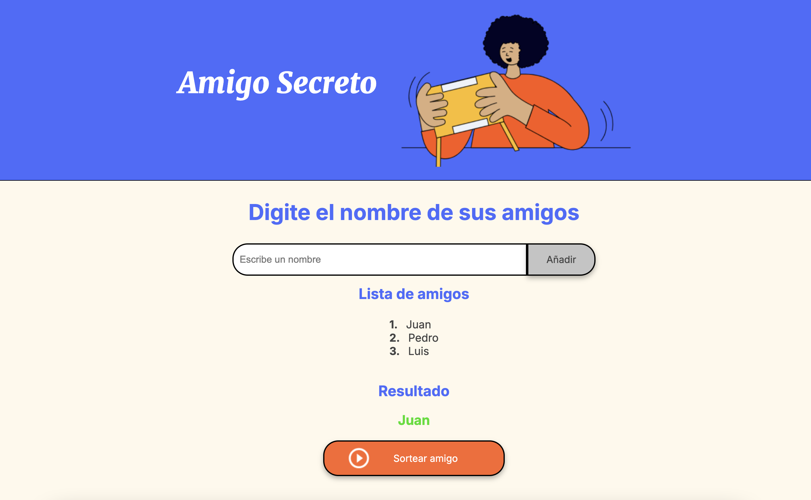

# Amigo Secreto

Este proyecto es una aplicación web diseñada para realizar un sorteo del juego del amigo secreto. Permite ingresar los nombres de los amigos y, presionando el botón de sorteo, elegir de forma aleatoria a uno de ellos.

## Características

- **Agregar amigos:** Ingresa y guarda los nombres de los amigos.
- **Lista de amigos:** Visualiza en pantalla todos los amigos que han sido agregados.
- **Sorteo aleatorio:** Selecciona al azar a un amigo como “amigo secreto”.
- **Validaciones:** Se muestra una alerta si se intenta agregar un nombre vacío o sortear con menos de dos amigos.

## Cómo Utilizarlo

1. **Agregar amigos:**
   - Escribe el nombre de un amigo en el campo de texto que aparece en la sección "Digite el nombre de sus amigos".
   
   - Haz clic en el botón “Añadir” para que el nombre se agregue a la lista.
   
   - Repite el proceso para agregar todos los amigos que desees.
   

2. **Realizar el sorteo:**
   - Asegúrate de haber agregado al menos dos amigos.
   - Haz clic en el botón “Sortear amigo”.
   - El resultado del sorteo se mostrará en la sección “Resultado”.

   

## Alertas

- Si intentas agregar un amigo sin escribir un nombre, aparecerá un mensaje pidiendo que ingreses un nombre.

- Si intentas realizar el sorteo con menos de dos amigos, se mostrará una alerta indicando el requisito mínimo.

